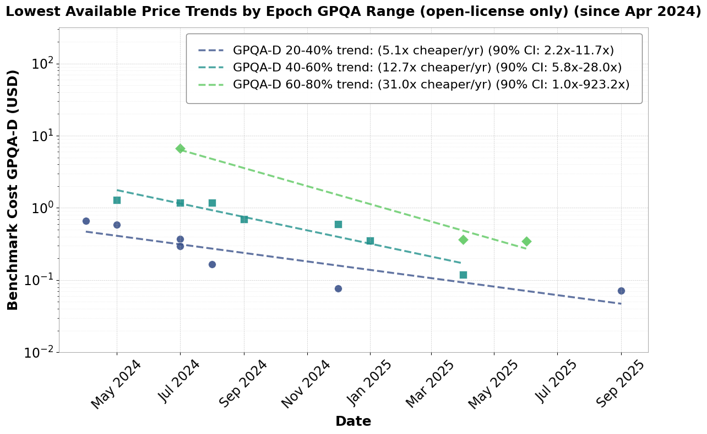

# Trends in Inference Efficiency

Code to analyse trends in inference prices to infer algorithmic progress in language model inference.

Repository to study the technical economics of AI inference.
main_regression.py is sufficient to generate the main regression results in our table.
neurips_paper_graphs.ipynb generates the majority of graphs in our paper.
