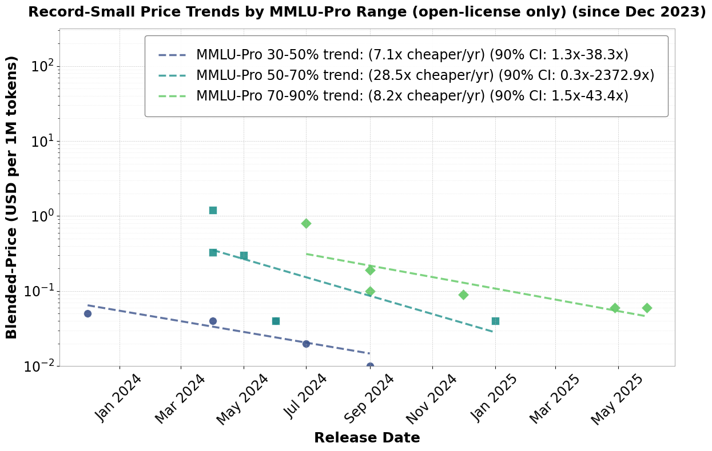

# Trends in Inference Efficiency

Code to analyse trends in inference prices to infer algorithmic progress in language model inference.



## How to Run

To run the `main.py` script, execute the following command in your terminal:

```bash
python main.py
```

## How to Test

To run the tests for this project, execute the following command in your terminal:

```bash
pytest test_main.py
```
