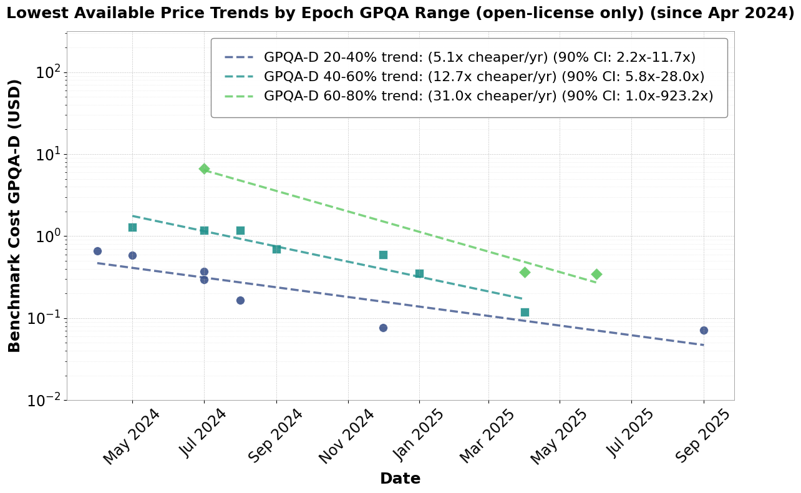

# Trends in Inference Efficiency

Code to analyse trends in inference prices to infer algorithmic progress in language model inference.
The data folder contains aime_price_reduction_modles.csv, price_reduction_modesls (GPQA), swe_price_reduction_modles.csv which contain our estimates for the price to run these benchmarks.

main_regression.py is sufficient to generate the main regression results in our table.
table_as_graph.ipynb generates the main figure showing factor decline for each benchmark. 

